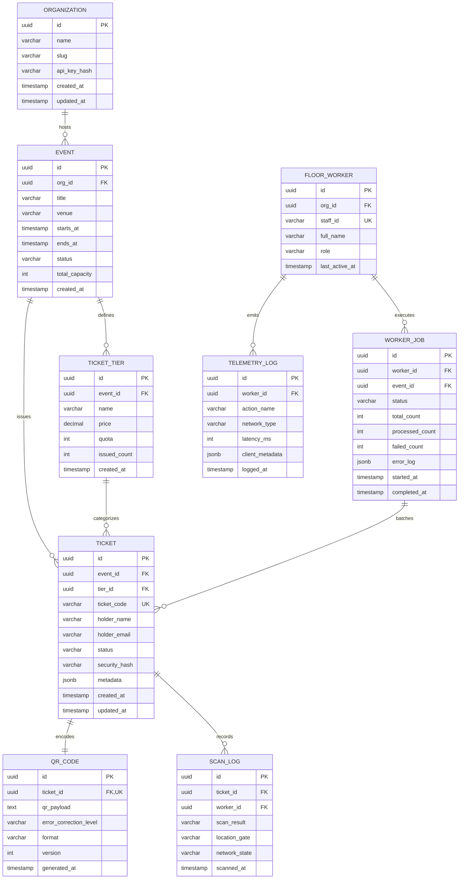

# Ticket QR Code Generator Worker - Database Schema Architecture (ERD)
**Ticket ID:** DEL-10254  
**Epic:** Core Infrastructure Overhaul  
**Priority:** P1 (High)  
**Reporter:** Amit Sharma (Senior Staff Engineer)  
**Architectural Stage:** Capstone 1 - Definitive Schema & Contract Definition

---

## 1. Executive Summary & Design Rationale
The Ticket QR Code Generator Worker replaces error-prone manual paper ticketing and fragile Excel sheets with a high-throughput, offline-resilient, enterprise-grade architecture.

To support floor staff operating in venues with intermittent or spotty connectivity (e.g., slow 2G tunnels, stadium concourses), the data model is designed around:
1. **Idempotent Ticket Generation:** Client-generated UUIDs + server-validated HMAC digests ensure zero duplicate generation.
2. **Worker Job Queuing:** Asynchronous batch generation and offline reconciliation.
3. **Auditability & Tamper Resistance:** Cryptographic verification hash (`security_hash`) embedded in the QR payload.
4. **Telemetry & Audit Logging:** Granular tracking of floor staff interactions and network states.

---

## 2. Entity Relationship Diagram (ERD)



---

## 3. Relational Table Specifications & Data Dictionaries

### 3.1. `tickets`
The core ledger table representing issued credentials.
| Column Name | Data Type | Constraints | Description |
| :--- | :--- | :--- | :--- |
| `id` | `UUID` | `PRIMARY KEY, DEFAULT gen_random_uuid()` | Unique entity identifier |
| `event_id` | `UUID` | `FOREIGN KEY REFERENCES events(id) ON DELETE RESTRICT` | Associated event |
| `tier_id` | `UUID` | `FOREIGN KEY REFERENCES ticket_tiers(id) ON DELETE RESTRICT` | Ticket tier (VIP, General, Floor) |
| `ticket_code` | `VARCHAR(32)` | `UNIQUE, NOT NULL` | Human-readable ticket reference (`TCK-2026-XXXXX`) |
| `holder_name` | `VARCHAR(255)` | `NOT NULL` | Sanitized attendee name (XSS purified) |
| `holder_email` | `VARCHAR(255)` | `NOT NULL` | Sanitized attendee email |
| `status` | `VARCHAR(32)` | `NOT NULL DEFAULT 'ISSUED'` | Enum: `ISSUED`, `CHECKED_IN`, `REVOKED`, `VOID` |
| `security_hash`| `VARCHAR(64)` | `NOT NULL` | HMAC-SHA256 signature for tamper verification |
| `metadata` | `JSONB` | `DEFAULT '{}'::jsonb` | Extensible fields (seat, gate, concessions) |
| `created_at` | `TIMESTAMPTZ` | `NOT NULL DEFAULT clock_timestamp()` | Creation audit timestamp |
| `updated_at` | `TIMESTAMPTZ` | `NOT NULL DEFAULT clock_timestamp()` | Last update timestamp |

**Indexes:**
- `CREATE INDEX idx_tickets_event_status ON tickets(event_id, status);`
- `CREATE INDEX idx_tickets_email ON tickets(holder_email);`
- `CREATE INDEX idx_tickets_code ON tickets(ticket_code);`

---

### 3.2. `qr_codes`
Decoupled payload table storing the exact serialized string and metadata encoded into the physical/digital matrix.
| Column Name | Data Type | Constraints | Description |
| :--- | :--- | :--- | :--- |
| `id` | `UUID` | `PRIMARY KEY, DEFAULT gen_random_uuid()` | Record UUID |
| `ticket_id` | `UUID` | `UNIQUE, NOT NULL, FOREIGN KEY REFERENCES tickets(id) ON DELETE CASCADE` | 1-to-1 relationship with ticket |
| `qr_payload` | `TEXT` | `NOT NULL` | Cryptographic string encoded inside QR matrix |
| `error_correction` | `VARCHAR(4)` | `NOT NULL DEFAULT 'M'` | Level: `L`, `M`, `Q`, `H` |
| `format` | `VARCHAR(16)` | `NOT NULL DEFAULT 'SVG'` | Primary storage format (`SVG`, `PNG_DATA_URL`) |
| `generated_at`| `TIMESTAMPTZ` | `NOT NULL DEFAULT clock_timestamp()` | Generation timestamp |

---

### 3.3. `worker_jobs`
Asynchronous job queue table managing high-volume batch generations and background synchronization.
| Column Name | Data Type | Constraints | Description |
| :--- | :--- | :--- | :--- |
| `id` | `UUID` | `PRIMARY KEY, DEFAULT gen_random_uuid()` | Job ID |
| `worker_id` | `UUID` | `FOREIGN KEY REFERENCES floor_workers(id)` | Assignee/worker identifier |
| `event_id` | `UUID` | `FOREIGN KEY REFERENCES events(id)` | Associated event |
| `status` | `VARCHAR(32)` | `NOT NULL DEFAULT 'QUEUED'` | `QUEUED`, `PROCESSING`, `COMPLETED`, `FAILED` |
| `total_count` | `INTEGER` | `NOT NULL DEFAULT 0` | Total tickets requested |
| `processed_count` | `INTEGER` | `NOT NULL DEFAULT 0` | Successfully created |
| `failed_count` | `INTEGER` | `NOT NULL DEFAULT 0` | Failed count |
| `error_log` | `JSONB` | `DEFAULT '[]'::jsonb` | Error stack traces and offending record rows |
| `created_at` | `TIMESTAMPTZ` | `NOT NULL DEFAULT clock_timestamp()` | Job enqueue timestamp |
| `completed_at` | `TIMESTAMPTZ` | `NULL` | Completion timestamp |

---

### 3.4. `telemetry_logs`
High-frequency logging table tracking floor staff latency, interactions, and intermittent connectivity.
| Column Name | Data Type | Constraints | Description |
| :--- | :--- | :--- | :--- |
| `id` | `UUID` | `PRIMARY KEY, DEFAULT gen_random_uuid()` | Telemetry ping UUID |
| `worker_id` | `UUID` | `FOREIGN KEY REFERENCES floor_workers(id)` | Staff operator |
| `action_name` | `VARCHAR(128)`| `NOT NULL` | E.g. `GENERATE_TICKET_QR`, `SEARCH_QUERY` |
| `network_type`| `VARCHAR(32)` | `NOT NULL` | E.g. `wifi`, `4g`, `2g_slow`, `offline` |
| `latency_ms` | `INTEGER` | `NOT NULL DEFAULT 0` | Measured client response latency |
| `client_metadata` | `JSONB` | `DEFAULT '{}'::jsonb` | Device, user-agent, memory state |
| `logged_at` | `TIMESTAMPTZ` | `NOT NULL DEFAULT clock_timestamp()` | Client/server timestamp |

---

## 4. Production PostgreSQL DDL Schema

```sql
-- Core Extensions
CREATE EXTENSION IF NOT EXISTS "uuid-ossp";
CREATE EXTENSION IF NOT EXISTS "pgcrypto";

-- Organizations
CREATE TABLE organizations (
    id UUID PRIMARY KEY DEFAULT gen_random_uuid(),
    name VARCHAR(255) NOT NULL,
    slug VARCHAR(100) UNIQUE NOT NULL,
    api_key_hash VARCHAR(64) NOT NULL,
    created_at TIMESTAMPTZ NOT NULL DEFAULT clock_timestamp(),
    updated_at TIMESTAMPTZ NOT NULL DEFAULT clock_timestamp()
);

-- Events
CREATE TABLE events (
    id UUID PRIMARY KEY DEFAULT gen_random_uuid(),
    org_id UUID NOT NULL REFERENCES organizations(id) ON DELETE CASCADE,
    title VARCHAR(255) NOT NULL,
    venue VARCHAR(255) NOT NULL,
    starts_at TIMESTAMPTZ NOT NULL,
    ends_at TIMESTAMPTZ NOT NULL,
    status VARCHAR(32) NOT NULL DEFAULT 'ACTIVE',
    total_capacity INTEGER NOT NULL CHECK (total_capacity > 0),
    created_at TIMESTAMPTZ NOT NULL DEFAULT clock_timestamp()
);

-- Ticket Tiers
CREATE TABLE ticket_tiers (
    id UUID PRIMARY KEY DEFAULT gen_random_uuid(),
    event_id UUID NOT NULL REFERENCES events(id) ON DELETE CASCADE,
    name VARCHAR(100) NOT NULL,
    price NUMERIC(10, 2) NOT NULL CHECK (price >= 0),
    quota INTEGER NOT NULL CHECK (quota >= 0),
    issued_count INTEGER NOT NULL DEFAULT 0,
    created_at TIMESTAMPTZ NOT NULL DEFAULT clock_timestamp()
);

-- Tickets
CREATE TABLE tickets (
    id UUID PRIMARY KEY DEFAULT gen_random_uuid(),
    event_id UUID NOT NULL REFERENCES events(id) ON DELETE RESTRICT,
    tier_id UUID NOT NULL REFERENCES ticket_tiers(id) ON DELETE RESTRICT,
    ticket_code VARCHAR(32) UNIQUE NOT NULL,
    holder_name VARCHAR(255) NOT NULL,
    holder_email VARCHAR(255) NOT NULL,
    status VARCHAR(32) NOT NULL DEFAULT 'ISSUED',
    security_hash VARCHAR(64) NOT NULL,
    metadata JSONB NOT NULL DEFAULT '{}'::jsonb,
    created_at TIMESTAMPTZ NOT NULL DEFAULT clock_timestamp(),
    updated_at TIMESTAMPTZ NOT NULL DEFAULT clock_timestamp(),
    CONSTRAINT chk_status CHECK (status IN ('ISSUED', 'CHECKED_IN', 'REVOKED', 'VOID'))
);

-- QR Code Payloads
CREATE TABLE qr_codes (
    id UUID PRIMARY KEY DEFAULT gen_random_uuid(),
    ticket_id UUID UNIQUE NOT NULL REFERENCES tickets(id) ON DELETE CASCADE,
    qr_payload TEXT NOT NULL,
    error_correction_level VARCHAR(4) NOT NULL DEFAULT 'M',
    format VARCHAR(16) NOT NULL DEFAULT 'SVG',
    version INTEGER NOT NULL DEFAULT 4,
    generated_at TIMESTAMPTZ NOT NULL DEFAULT clock_timestamp()
);

-- Floor Workers
CREATE TABLE floor_workers (
    id UUID PRIMARY KEY DEFAULT gen_random_uuid(),
    org_id UUID NOT NULL REFERENCES organizations(id) ON DELETE CASCADE,
    staff_id VARCHAR(64) UNIQUE NOT NULL,
    full_name VARCHAR(255) NOT NULL,
    role VARCHAR(64) NOT NULL DEFAULT 'FLOOR_STAFF',
    last_active_at TIMESTAMPTZ NOT NULL DEFAULT clock_timestamp()
);

-- Worker Batch Jobs
CREATE TABLE worker_jobs (
    id UUID PRIMARY KEY DEFAULT gen_random_uuid(),
    worker_id UUID REFERENCES floor_workers(id) ON DELETE SET NULL,
    event_id UUID NOT NULL REFERENCES events(id) ON DELETE CASCADE,
    status VARCHAR(32) NOT NULL DEFAULT 'QUEUED',
    total_count INTEGER NOT NULL DEFAULT 0,
    processed_count INTEGER NOT NULL DEFAULT 0,
    failed_count INTEGER NOT NULL DEFAULT 0,
    error_log JSONB NOT NULL DEFAULT '[]'::jsonb,
    created_at TIMESTAMPTZ NOT NULL DEFAULT clock_timestamp(),
    completed_at TIMESTAMPTZ
);

-- Telemetry Logs
CREATE TABLE telemetry_logs (
    id UUID PRIMARY KEY DEFAULT gen_random_uuid(),
    worker_id UUID REFERENCES floor_workers(id) ON DELETE SET NULL,
    action_name VARCHAR(128) NOT NULL,
    network_type VARCHAR(32) NOT NULL,
    latency_ms INTEGER NOT NULL DEFAULT 0,
    client_metadata JSONB NOT NULL DEFAULT '{}'::jsonb,
    logged_at TIMESTAMPTZ NOT NULL DEFAULT clock_timestamp()
);

-- Performance Indexes
CREATE INDEX idx_tickets_event_id ON tickets(event_id);
CREATE INDEX idx_tickets_tier_id ON tickets(tier_id);
CREATE INDEX idx_tickets_code ON tickets(ticket_code);
CREATE INDEX idx_tickets_status ON tickets(status);
CREATE INDEX idx_telemetry_action ON telemetry_logs(action_name);
CREATE INDEX idx_telemetry_logged_at ON telemetry_logs(logged_at DESC);
```
